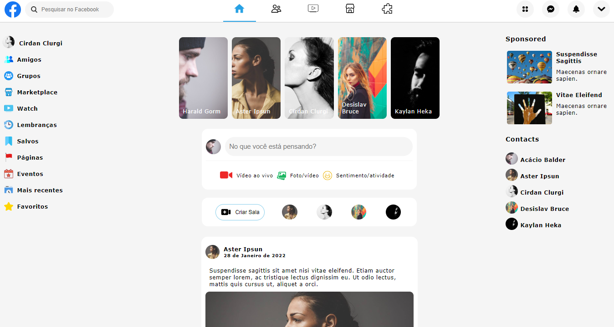

<h1>Facebook Clone</h1>
<h2>React Js</h2>

<h4>
    Link do Projeto: 
    <a href="https://katarinealbuquerque.github.io/facebook-clone-reactjs-site/">Abrir Facebook Clone</a>
</h4>

<h2>I. Sobre</h2>

Front-end em React Js com uso de componetes reutilizáveis e layout flexível. O projeto está organizado em pastas para facilitar a manutenção do site.

<h2>II. Layout do Projeto</h2>

<h2>III. Tecnologias Utilizadas</h2>

React Js

Flexbox

<h2>IV. Autor</h2>
<h4>Katarine Albuquerque</h4>

<h2>Veja Mais</h2>

    <i><u>Linkedin</u>: </i>
    <a href="https://www.linkedin.com/in/katarine-albuquerque/">/ katarine-albuquerque</a>

    <i><u>GitHub</u>: </i>
    <a href="https://github.com/KatarineAlbuquerque">/ KatarineAlbuquerque</a>

    <i><u>Portfólio</u>: </i>
    <a href="https://github.com/KatarineAlbuquerque/my-portfolio">/ my-portfolio</a>

